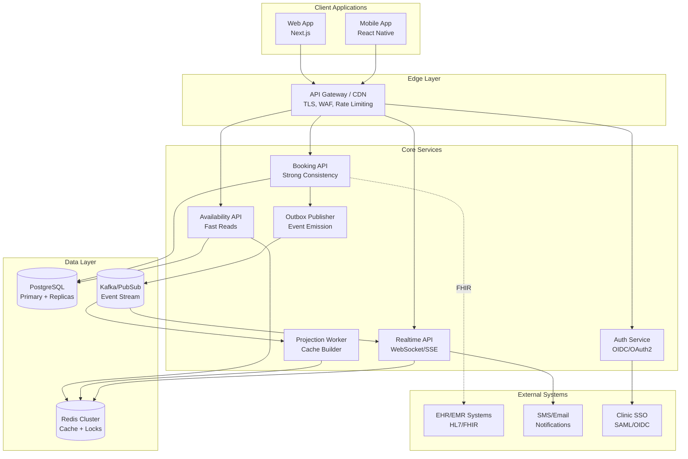
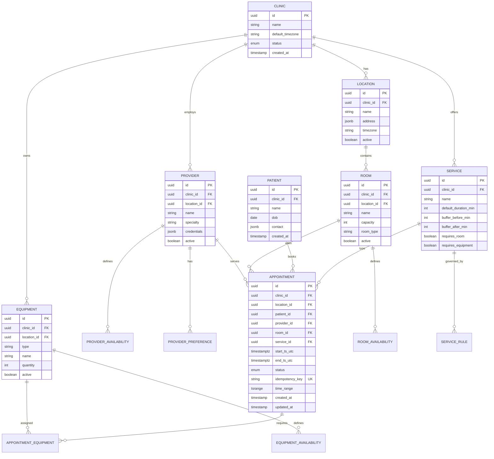
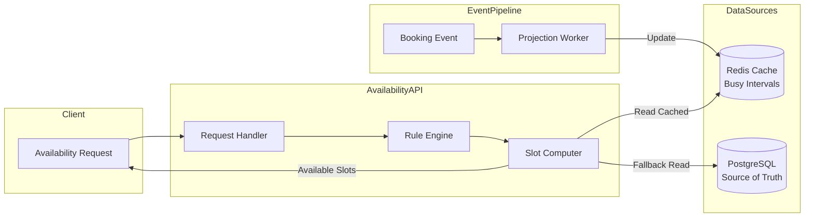
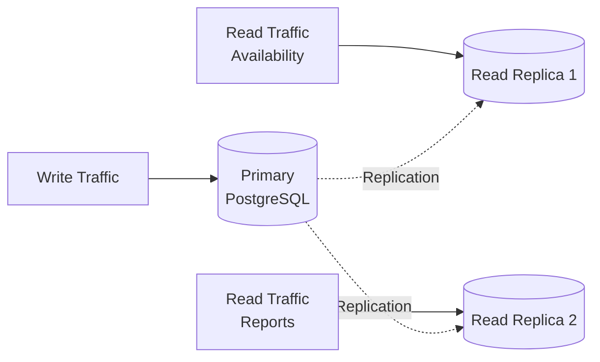
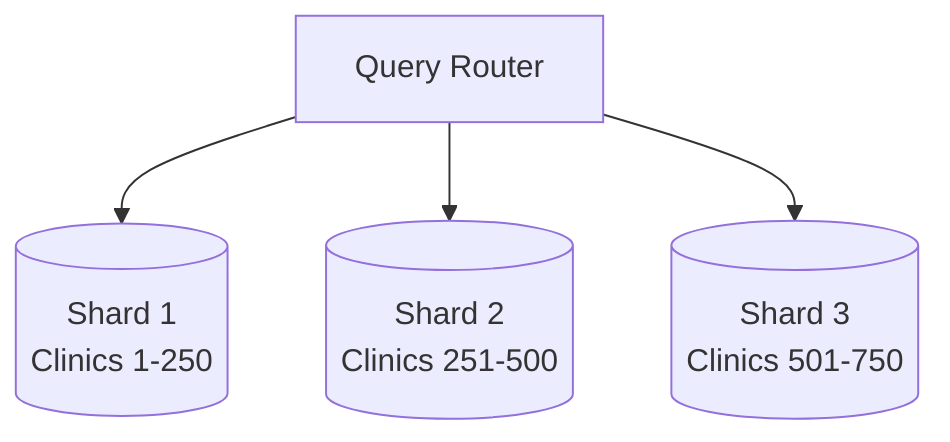
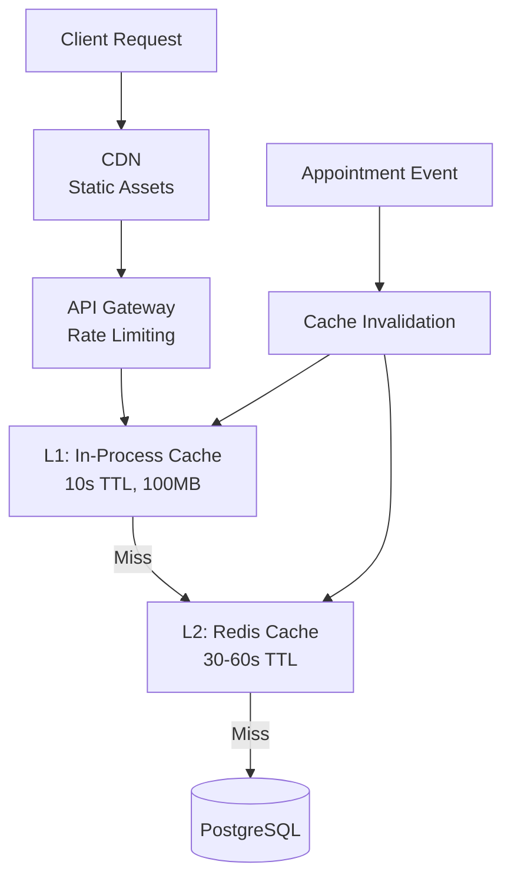

# Multi-Clinic Appointment Scheduling System - Technical Design Document

**Version:** 1.0  
**Date:** February 15, 2026  
**Author:** System Architecture Team  

---

## Table of Contents

1. [System Overview](#1-system-overview)
2. [Data Model](#2-data-model)
3. [Availability Engine](#3-availability-engine)
4. [API Design](#4-api-design)
5. [Frontend Architecture](#5-frontend-architecture)
6. [Scalability & Reliability](#6-scalability--reliability)
7. [Observability](#7-observability)
8. [Appendices](#appendices)

---

## 1. System Overview

### 1.1 Goals

**Correctness First**
- Never double-book a provider, room, or equipment
- Respect buffer times and complex scheduling rules
- Maintain data integrity under concurrent operations

**Fast Availability**
- Sub-second perceived latency for availability queries
- Users expect "what's available right now" with no delays
- Support for real-time slot calculation across multiple constraints

**Real-Time Updates**
- When someone books or cancels, other clients see availability changes immediately
- Push notifications to relevant stakeholders
- Optimistic UI updates with proper conflict resolution

**Multi-Tenant Architecture**
- Support 500 clinics with clear data isolation
- Admin boundaries per clinic
- Proper security and compliance (HIPAA-ready)

**Resilient & Scalable**
- Handle 50,000 appointments per day (~0.58/sec average, 10-50x peak)
- Gracefully handle traffic spikes (morning rush hours)
- Recover from partial failures without data loss

### 1.2 Non-Goals (Explicitly Out of Scope)

- Billing/claims processing
- Insurance eligibility verification
- Clinical documentation and EHR functionality
- Provider payroll and full HR scheduling
- Patient medical records management

### 1.3 High-Level Architecture

**Key Design Principle:** Separate booking (strong consistency) from availability computation (fast, cacheable, scalable), while keeping them in sync via events.



### 1.4 Component Responsibilities

#### API Gateway / Edge
- **Purpose:** Entry point for all client requests
- **Capabilities:**
  - TLS termination and SSL certificate management
  - Request routing to appropriate services
  - Web Application Firewall (WAF) protection
  - Rate limiting (per IP, per user, per clinic)
  - Static asset caching and CDN integration
  - WebSocket/SSE connection upgrades
- **Technology:** Kong, AWS API Gateway, or Cloudflare Workers

#### Auth Service
- **Purpose:** Identity and access management
- **Capabilities:**
  - OIDC/OAuth2 authentication flows
  - JWT token generation with clinic/role claims
  - Clinic SSO integration (SAML, OIDC)
  - Multi-factor authentication (MFA)
  - Session management
- **Claims Structure:**
  ```json
  {
    "sub": "user_id",
    "clinic_id": "clinic_uuid",
    "role": "provider|front_desk|admin",
    "scopes": ["read:appointments", "write:appointments"],
    "exp": 1234567890
  }
  ```

#### Booking API
- **Purpose:** Source of truth for all appointment operations
- **Capabilities:**
  - Create, update, cancel, reschedule appointments
  - Strong consistency via database transactions
  - Conflict detection using range overlap checks
  - Resource allocation (rooms, equipment)
  - Idempotency guarantees
  - Audit trail generation
- **Transaction Guarantees:** ACID compliant

#### Availability API
- **Purpose:** Fast computation of available time slots
- **Capabilities:**
  - Real-time slot calculation
  - Multi-constraint evaluation (provider, room, equipment)
  - Rule engine execution
  - Cache-first architecture
  - Fallback to database when cache misses
- **Performance Target:** p95 < 200ms, p99 < 500ms

#### Realtime API
- **Purpose:** Push updates to connected clients
- **Capabilities:**
  - WebSocket channels per clinic/provider/location
  - Server-Sent Events (SSE) as fallback
  - Subscription management
  - Event fanout and filtering
  - Connection presence tracking
- **Scale Target:** 10,000+ concurrent connections

#### Outbox Publisher
- **Purpose:** Reliable event emission
- **Capabilities:**
  - Polls outbox table in database
  - Publishes events to Kafka/PubSub
  - Marks events as published
  - Retry logic with exponential backoff
  - At-least-once delivery guarantee
- **Pattern:** Transactional Outbox Pattern

#### Projection Worker
- **Purpose:** Build and maintain availability caches
- **Capabilities:**
  - Consumes appointment events from Kafka
  - Computes busy intervals per resource
  - Updates Redis projections
  - Handles time zone conversions
  - Invalidates stale cache entries
- **Processing:** Idempotent event handling

### 1.5 Technology Stack Justification

#### Backend Language: TypeScript (Node.js) or Java/Kotlin

**TypeScript (Node.js):**
- **Pros:**
  - Code sharing with frontend (types, validation)
  - Rapid development and iteration
  - Rich ecosystem (NestJS, Fastify)
  - Strong async I/O performance
  - OpenTelemetry support
- **Cons:**
  - Less mature for heavy compute workloads
  - Garbage collection tuning complexity

**Java/Kotlin:**
- **Pros:**
  - Mature concurrency primitives
  - Spring Boot ecosystem maturity
  - Superior performance for CPU-intensive tasks
  - Better tooling for large-scale systems
- **Cons:**
  - Startup time overhead
  - Less code sharing with React frontend

**Recommendation:** TypeScript for faster iteration and team skill alignment, with option to migrate specific services to JVM if needed.

#### Database: PostgreSQL

**Why PostgreSQL:**
- Excellent ACID transactional guarantees
- Rich indexing capabilities (B-tree, GiST, BRIN)
- Native range types for interval overlap queries
- JSONB for flexible rule storage
- Proven at scale with proper partitioning
- Strong community and tooling
- Time-series query optimization via BRIN indexes

**Alternatives Considered:**
- MySQL: Weaker support for range types and advanced indexing
- MongoDB: Insufficient transaction guarantees for booking conflicts
- Cassandra: Overkill for write volume; poor transaction support

#### Cache: Redis

**Why Redis:**
- Sub-millisecond read latency
- Atomic operations (INCR, ZADD) for locks and counters
- Pub/Sub for realtime invalidation
- Data structures (sorted sets, hashes) for complex projections
- Cluster mode for horizontal scaling
- Proven reliability

**Use Cases:**
- Availability cache (busy intervals, computed slots)
- Distributed locks for booking coordination
- Rate limiting counters
- WebSocket session tracking
- Pub/Sub for cache invalidation

#### Event Streaming: Kafka

**Why Kafka:**
- At-least-once delivery guarantee
- Handles 50,000+ events/day easily
- Durable message storage
- Consumer groups for parallel processing
- Replay capability for rebuilding projections
- Integration ecosystem (Debezium, Kafka Connect)

**Alternatives:**
- RabbitMQ: Less durable; not built for replay
- AWS SNS/SQS: Managed option, lower durability guarantees
- Google Cloud Pub/Sub: Good managed alternative for GCP deployments

#### Realtime: WebSocket + SSE

**WebSocket (Primary):**
- Bidirectional communication
- Lower latency for frequent updates
- Better for interactive features (live calendar editing)

**SSE (Fallback):**
- Simpler implementation
- Better browser compatibility
- Sufficient for one-way updates
- Easier to scale (stateless)

**Implementation:** Socket.IO (TS) or Spring WebSocket (Java)

### 1.6 Integration Points

#### EHR/EMR Integration
- **Protocol:** HL7 FHIR R4
- **Resources:**
  - Appointment
  - Patient (reference only)
  - Practitioner (provider mapping)
  - Location
- **Direction:**
  - Outbound: Send appointment create/update/cancel
  - Inbound: Receive patient demographic updates (optional)
- **Authentication:** OAuth2 client credentials

#### Messaging Providers
- **Use Cases:**
  - Appointment confirmations
  - Reminder notifications (24h, 1h before)
  - Cancellation notices
  - Provider schedule changes
- **Channels:** SMS (Twilio), Email (SendGrid), Push (FCM/APNS)
- **Template Management:** Clinic-specific templates

#### Clinic SSO / Directory
- **Protocols:** SAML 2.0, OIDC
- **Identity Providers:** Okta, Azure AD, Auth0
- **Role Mapping:** IdP groups → application roles
- **Just-In-Time Provisioning:** Auto-create user records on first login

#### Analytics / BI
- **Use Cases:**
  - Appointment volume trends
  - No-show rates per provider/clinic
  - Resource utilization (room occupancy)
  - Peak hour analysis
- **Destination:** BigQuery, Snowflake
- **Pipeline:** Kafka → Kafka Connect → Warehouse
- **Refresh:** Near real-time (< 5 min lag)

---

## 2. Data Model

### 2.1 Core Entities and Relationships



### 2.2 Table Schemas (Detailed)

#### Clinics & Locations

```sql
CREATE TABLE clinic (
    id UUID PRIMARY KEY DEFAULT gen_random_uuid(),
    name VARCHAR(255) NOT NULL,
    default_timezone VARCHAR(50) NOT NULL, -- IANA timezone
    status VARCHAR(20) NOT NULL DEFAULT 'active', -- active|suspended|archived
    metadata JSONB DEFAULT '{}',
    created_at TIMESTAMPTZ NOT NULL DEFAULT NOW(),
    updated_at TIMESTAMPTZ NOT NULL DEFAULT NOW()
);

CREATE TABLE location (
    id UUID PRIMARY KEY DEFAULT gen_random_uuid(),
    clinic_id UUID NOT NULL REFERENCES clinic(id),
    name VARCHAR(255) NOT NULL,
    address JSONB NOT NULL, -- {street, city, state, zip, country}
    timezone VARCHAR(50), -- override clinic default if needed
    active BOOLEAN NOT NULL DEFAULT true,
    created_at TIMESTAMPTZ NOT NULL DEFAULT NOW(),
    
    CONSTRAINT unique_location_name_per_clinic 
        UNIQUE (clinic_id, name)
);

CREATE INDEX idx_location_clinic ON location(clinic_id) 
    WHERE active = true;
```

#### Resources (Providers, Rooms, Equipment)

```sql
CREATE TABLE provider (
    id UUID PRIMARY KEY DEFAULT gen_random_uuid(),
    clinic_id UUID NOT NULL REFERENCES clinic(id),
    location_id UUID REFERENCES location(id), -- primary location
    name VARCHAR(255) NOT NULL,
    specialty VARCHAR(100),
    credentials JSONB DEFAULT '{}', -- license, certifications
    active BOOLEAN NOT NULL DEFAULT true,
    created_at TIMESTAMPTZ NOT NULL DEFAULT NOW()
);

CREATE INDEX idx_provider_clinic ON provider(clinic_id) 
    WHERE active = true;
CREATE INDEX idx_provider_specialty ON provider(specialty) 
    WHERE active = true;

CREATE TABLE room (
    id UUID PRIMARY KEY DEFAULT gen_random_uuid(),
    clinic_id UUID NOT NULL REFERENCES clinic(id),
    location_id UUID NOT NULL REFERENCES location(id),
    name VARCHAR(100) NOT NULL,
    capacity INT NOT NULL DEFAULT 1,
    room_type VARCHAR(50), -- exam|procedure|consultation
    features JSONB DEFAULT '{}',
    active BOOLEAN NOT NULL DEFAULT true,
    created_at TIMESTAMPTZ NOT NULL DEFAULT NOW(),
    
    CONSTRAINT unique_room_name_per_location 
        UNIQUE (location_id, name)
);

CREATE INDEX idx_room_location ON room(location_id) 
    WHERE active = true;

CREATE TABLE equipment (
    id UUID PRIMARY KEY DEFAULT gen_random_uuid(),
    clinic_id UUID NOT NULL REFERENCES clinic(id),
    location_id UUID REFERENCES location(id),
    type VARCHAR(100) NOT NULL, -- xray|ultrasound|ecg
    name VARCHAR(255) NOT NULL,
    quantity INT NOT NULL DEFAULT 1, -- for pooled equipment
    active BOOLEAN NOT NULL DEFAULT true,
    created_at TIMESTAMPTZ NOT NULL DEFAULT NOW()
);

CREATE INDEX idx_equipment_type_location ON equipment(type, location_id) 
    WHERE active = true;
```

#### Patients & Appointments

```sql
CREATE TABLE patient (
    id UUID PRIMARY KEY DEFAULT gen_random_uuid(),
    clinic_id UUID NOT NULL REFERENCES clinic(id),
    name VARCHAR(255) NOT NULL,
    dob DATE NOT NULL,
    contact JSONB NOT NULL, -- {phone, email, preferred_method}
    metadata JSONB DEFAULT '{}',
    created_at TIMESTAMPTZ NOT NULL DEFAULT NOW(),
    updated_at TIMESTAMPTZ NOT NULL DEFAULT NOW()
);

CREATE INDEX idx_patient_clinic ON patient(clinic_id);
CREATE INDEX idx_patient_name ON patient(name); -- for search

CREATE TABLE appointment (
    id UUID PRIMARY KEY DEFAULT gen_random_uuid(),
    clinic_id UUID NOT NULL REFERENCES clinic(id),
    location_id UUID NOT NULL REFERENCES location(id),
    patient_id UUID NOT NULL REFERENCES patient(id),
    provider_id UUID NOT NULL REFERENCES provider(id),
    room_id UUID REFERENCES room(id),
    service_id UUID NOT NULL REFERENCES service(id),
    
    start_ts_utc TIMESTAMPTZ NOT NULL,
    end_ts_utc TIMESTAMPTZ NOT NULL,
    time_range TSRANGE GENERATED ALWAYS AS (
        tsrange(start_ts_utc, end_ts_utc, '[)')
    ) STORED,
    
    status VARCHAR(20) NOT NULL DEFAULT 'scheduled',
    -- scheduled|confirmed|checked_in|in_progress|completed|canceled|no_show
    
    notes TEXT,
    metadata JSONB DEFAULT '{}',
    
    idempotency_key VARCHAR(255) NOT NULL,
    
    created_at TIMESTAMPTZ NOT NULL DEFAULT NOW(),
    updated_at TIMESTAMPTZ NOT NULL DEFAULT NOW(),
    
    CONSTRAINT check_end_after_start 
        CHECK (end_ts_utc > start_ts_utc),
    CONSTRAINT unique_idempotency_per_clinic 
        UNIQUE (clinic_id, idempotency_key)
);

-- Partition by month for performance
CREATE TABLE appointment_2026_02 PARTITION OF appointment
    FOR VALUES FROM ('2026-02-01') TO ('2026-03-01');
-- ... create additional partitions monthly

-- Critical indexes for overlap detection
CREATE INDEX idx_appointment_provider_range_gist 
    ON appointment USING gist (clinic_id, provider_id, time_range);
    
CREATE INDEX idx_appointment_room_range_gist 
    ON appointment USING gist (clinic_id, room_id, time_range)
    WHERE room_id IS NOT NULL;

-- Indexes for queries
CREATE INDEX idx_appointment_provider_date 
    ON appointment (clinic_id, provider_id, start_ts_utc);
    
CREATE INDEX idx_appointment_location_date 
    ON appointment (clinic_id, location_id, start_ts_utc);
    
CREATE INDEX idx_appointment_patient_date 
    ON appointment (clinic_id, patient_id, start_ts_utc DESC);

CREATE TABLE appointment_equipment (
    appointment_id UUID NOT NULL REFERENCES appointment(id) ON DELETE CASCADE,
    equipment_id UUID NOT NULL REFERENCES equipment(id),
    units_required INT NOT NULL DEFAULT 1,
    
    PRIMARY KEY (appointment_id, equipment_id),
    CONSTRAINT check_units_positive CHECK (units_required > 0)
);

CREATE INDEX idx_appt_equipment_appointment 
    ON appointment_equipment(appointment_id);
```

#### Services & Rules

```sql
CREATE TABLE service (
    id UUID PRIMARY KEY DEFAULT gen_random_uuid(),
    clinic_id UUID NOT NULL REFERENCES clinic(id),
    name VARCHAR(255) NOT NULL,
    description TEXT,
    
    default_duration_min INT NOT NULL,
    buffer_before_min INT NOT NULL DEFAULT 0,
    buffer_after_min INT NOT NULL DEFAULT 0,
    
    requires_room BOOLEAN NOT NULL DEFAULT true,
    requires_equipment BOOLEAN NOT NULL DEFAULT false,
    
    active BOOLEAN NOT NULL DEFAULT true,
    created_at TIMESTAMPTZ NOT NULL DEFAULT NOW(),
    
    CONSTRAINT check_duration_positive 
        CHECK (default_duration_min > 0)
);

CREATE INDEX idx_service_clinic ON service(clinic_id) 
    WHERE active = true;

CREATE TABLE service_rule (
    id UUID PRIMARY KEY DEFAULT gen_random_uuid(),
    clinic_id UUID NOT NULL REFERENCES clinic(id),
    service_id UUID NOT NULL REFERENCES service(id),
    
    rule_type VARCHAR(50) NOT NULL,
    -- allowed_provider|required_equipment_type|min_gap|
    -- room_type|max_daily|lead_time|blackout_dates
    
    rule_payload JSONB NOT NULL,
    -- Examples:
    -- {provider_ids: [uuid1, uuid2]}
    -- {equipment_type: "xray", min_units: 1}
    -- {min_gap_minutes: 15}
    -- {max_per_day: 8}
    
    priority INT NOT NULL DEFAULT 100,
    active BOOLEAN NOT NULL DEFAULT true,
    created_at TIMESTAMPTZ NOT NULL DEFAULT NOW()
);

CREATE INDEX idx_service_rule_service ON service_rule(service_id) 
    WHERE active = true;
```

#### Availability Windows

```sql
CREATE TABLE provider_availability (
    id UUID PRIMARY KEY DEFAULT gen_random_uuid(),
    clinic_id UUID NOT NULL REFERENCES clinic(id),
    provider_id UUID NOT NULL REFERENCES provider(id),
    
    start_ts_utc TIMESTAMPTZ NOT NULL,
    end_ts_utc TIMESTAMPTZ NOT NULL,
    time_range TSRANGE GENERATED ALWAYS AS (
        tsrange(start_ts_utc, end_ts_utc, '[)')
    ) STORED,
    
    recurrence_rule TEXT, -- iCalendar RRULE format
    kind VARCHAR(20) NOT NULL, -- available|unavailable|override
    source VARCHAR(20) NOT NULL DEFAULT 'manual', -- manual|imported
    
    created_at TIMESTAMPTZ NOT NULL DEFAULT NOW(),
    
    CONSTRAINT check_end_after_start_avail 
        CHECK (end_ts_utc > start_ts_utc)
);

CREATE INDEX idx_provider_availability_range 
    ON provider_availability USING gist (provider_id, time_range);

-- Similar tables for room_availability and equipment_availability
CREATE TABLE room_availability (
    id UUID PRIMARY KEY DEFAULT gen_random_uuid(),
    clinic_id UUID NOT NULL REFERENCES clinic(id),
    room_id UUID NOT NULL REFERENCES room(id),
    start_ts_utc TIMESTAMPTZ NOT NULL,
    end_ts_utc TIMESTAMPTZ NOT NULL,
    time_range TSRANGE GENERATED ALWAYS AS (
        tsrange(start_ts_utc, end_ts_utc, '[)')
    ) STORED,
    kind VARCHAR(20) NOT NULL,
    reason TEXT,
    created_at TIMESTAMPTZ NOT NULL DEFAULT NOW()
);

CREATE TABLE provider_preference (
    id UUID PRIMARY KEY DEFAULT gen_random_uuid(),
    clinic_id UUID NOT NULL REFERENCES clinic(id),
    provider_id UUID NOT NULL REFERENCES provider(id),
    service_id UUID REFERENCES service(id),
    
    preferred_room_ids UUID[], -- array of room IDs
    preferred_equipment_type VARCHAR(100),
    preferred_time_windows JSONB, -- [{start: "09:00", end: "12:00"}]
    
    weight INT NOT NULL DEFAULT 50, -- 0-100 preference strength
    created_at TIMESTAMPTZ NOT NULL DEFAULT NOW()
);
```

#### Outbox (Transactional Event Publishing)

```sql
CREATE TABLE outbox_event (
    id BIGSERIAL PRIMARY KEY,
    clinic_id UUID NOT NULL,
    aggregate_type VARCHAR(50) NOT NULL, -- appointment|availability
    aggregate_id UUID NOT NULL,
    event_type VARCHAR(100) NOT NULL,
    -- appointment.created|appointment.updated|appointment.canceled
    
    payload JSONB NOT NULL,
    metadata JSONB DEFAULT '{}',
    
    created_at TIMESTAMPTZ NOT NULL DEFAULT NOW(),
    published_at TIMESTAMPTZ,
    
    CONSTRAINT check_clinic_id_not_null CHECK (clinic_id IS NOT NULL)
);

CREATE INDEX idx_outbox_unpublished 
    ON outbox_event (created_at) 
    WHERE published_at IS NULL;

CREATE INDEX idx_outbox_aggregate 
    ON outbox_event (aggregate_type, aggregate_id, created_at DESC);
```

### 2.3 Indexing Strategy Summary

#### Query Pattern Analysis

| Query Pattern | Frequency | Index Used |
|---|---|---|
| Find appointments for provider on date | Very High | `idx_appointment_provider_date` |
| Check provider overlap conflicts | High | `idx_appointment_provider_range_gist` |
| Check room overlap conflicts | High | `idx_appointment_room_range_gist` |
| Patient appointment history | Medium | `idx_appointment_patient_date` |
| Location-wide calendar view | Medium | `idx_appointment_location_date` |
| Idempotency deduplication | High | `unique_idempotency_per_clinic` |

#### Index Maintenance

- **Vacuum:** Auto-vacuum tuned for high update rate on `appointment` table
- **Statistics:** Run `ANALYZE` after bulk operations
- **Bloat Monitoring:** Track index size growth; rebuild if bloat > 30%
- **Partition Pruning:** Ensure queries include date filters to leverage partitioning

---

## 3. Availability Engine

### 3.1 Design Requirements

The Availability Engine must compute available time slots in real-time while satisfying multiple constraints:

1. **Provider Constraints**
   - Working hours and availability windows
   - Time-off requests and breaks
   - Maximum appointments per day limits
   - Minimum gap between appointments

2. **Room Constraints**
   - Room availability and maintenance windows
   - Room type requirements per service
   - Capacity limitations
   - Cleaning/turnaround buffers

3. **Equipment Constraints**
   - Equipment availability and downtime
   - Pooled resource unit tracking
   - Calibration and maintenance schedules
   - Concurrent usage limits

4. **Service Requirements**
   - Service duration
   - Before/after buffer times
   - Specific resource type requirements
   - Lead time restrictions (no same-day bookings)

5. **Scheduling Policies**
   - Minimum gap between similar services
   - Maximum daily bookings per service
   - Provider preferences and rankings
   - Patient-specific restrictions

### 3.2 High-Level Architecture

**Hybrid Approach:** Combine strong consistency for bookings with fast cached projections for availability.



### 3.3 Computing Available Slots (Algorithm)

#### Input Parameters

```typescript
interface AvailabilityRequest {
  clinicId: string;
  locationId: string;
  serviceId: string;
  dateRange: {
    start: string; // ISO 8601 local datetime
    end: string;   // ISO 8601 local datetime
  };
  filters?: {
    providerIds?: string[];
    preferredTimeOfDay?: 'morning' | 'afternoon' | 'evening';
    minRating?: number;
  };
}
```

#### Step-by-Step Algorithm

**Step 1: Normalize Time Range**

```typescript
// Convert local time to UTC based on location timezone
const timezone = await getLocationTimezone(locationId);
const utcStart = localToUTC(dateRange.start, timezone);
const utcEnd = localToUTC(dateRange.end, timezone);
```

**Step 2: Load Service Requirements**

```typescript
const service = await db.service.findUnique({
  where: { id: serviceId, clinicId },
  include: { rules: { where: { active: true } } }
});

const duration = service.default_duration_min;
const bufferBefore = service.buffer_before_min;
const bufferAfter = service.buffer_after_min;
const totalDuration = bufferBefore + duration + bufferAfter;
```

**Step 3: Generate Provider Candidate Windows**

```typescript
// Get all eligible providers
const providers = await getEligibleProviders(
  clinicId, 
  locationId, 
  serviceId, 
  filters?.providerIds
);

const candidateWindows = [];

for (const provider of providers) {
  // Get availability windows
  const availWindows = await getProviderAvailability(
    provider.id,
    utcStart,
    utcEnd
  );
  
  // Intersect with clinic hours
  const clinicHours = await getClinicHours(clinicId, utcStart, utcEnd);
  const windows = intersectIntervals(availWindows, clinicHours);
  
  // Remove unavailable overrides (PTO, breaks)
  const unavailable = await getProviderUnavailable(
    provider.id,
    utcStart,
    utcEnd
  );
  const freeWindows = subtractIntervals(windows, unavailable);
  
  candidateWindows.push({ provider, windows: freeWindows });
}
```

**Step 4: Subtract Busy Intervals**

```typescript
for (const candidate of candidateWindows) {
  // Read from Redis cache first
  const busyIntervals = await redis.get(
    `busy:clinic:${clinicId}:provider:${candidate.provider.id}:range:${dateKey}`
  );
  
  // If cache miss or stale, compute from DB
  if (!busyIntervals || isCacheStale(busyIntervals)) {
    const appointments = await db.appointment.findMany({
      where: {
        clinicId,
        providerId: candidate.provider.id,
        time_range: { overlaps: [utcStart, utcEnd] }
      },
      select: { start_ts_utc: true, end_ts_utc: true }
    });
    
    // Include buffer times
    busyIntervals = appointments.map(apt => ({
      start: apt.start_ts_utc - service.buffer_before_min * 60000,
      end: apt.end_ts_utc + service.buffer_after_min * 60000
    }));
    
    // Update cache
    await redis.setex(cacheKey, 60, busyIntervals);
  }
  
  // Subtract busy from free windows
  candidate.slots = subtractIntervals(candidate.windows, busyIntervals);
}
```

**Step 5: Apply Room & Equipment Feasibility**

```typescript
const feasibleSlots = [];

for (const candidate of candidateWindows) {
  for (const slot of candidate.slots) {
    // Check room availability
    const availableRooms = await findAvailableRooms(
      clinicId,
      locationId,
      slot.start,
      slot.end,
      service.room_type
    );
    
    if (availableRooms.length === 0) continue;
    
    // Check equipment availability (if required)
    if (service.requires_equipment) {
      const equipmentAvailable = await checkEquipmentAvailability(
        clinicId,
        locationId,
        service.required_equipment_type,
        slot.start,
        slot.end
      );
      
      if (!equipmentAvailable) continue;
    }
    
    feasibleSlots.push({
      start: slot.start,
      end: slot.end,
      provider: candidate.provider,
      roomOptions: availableRooms,
      score: calculateSlotScore(slot, candidate.provider)
    });
  }
}
```

**Step 6: Apply Policy Rules**

```typescript
// Filter by service-specific rules
for (const rule of service.rules) {
  switch (rule.rule_type) {
    case 'max_daily':
      // Count existing appointments for this service
      feasibleSlots = await filterByMaxDaily(feasibleSlots, rule);
      break;
    case 'min_gap':
      // Ensure minimum time between same service bookings
      feasibleSlots = filterByMinGap(feasibleSlots, rule);
      break;
    case 'lead_time':
      // Filter out slots too soon
      feasibleSlots = filterByLeadTime(feasibleSlots, rule);
      break;
  }
}
```

**Step 7: Rank and Return**

```typescript
// Sort by score (based on provider preferences, time-of-day, etc.)
feasibleSlots.sort((a, b) => b.score - a.score);

// Convert back to local time
return feasibleSlots.map(slot => ({
  start: utcToLocal(slot.start, timezone),
  end: utcToLocal(slot.end, timezone),
  startUTC: slot.start,
  endUTC: slot.end,
  provider: slot.provider,
  roomOptions: slot.roomOptions,
  score: slot.score
}));
```

### 3.4 Handling Concurrent Booking Attempts

**Problem:** Two users try to book the same slot simultaneously.

**Solution:** Multi-layered defense strategy

#### Layer 1: Optimistic Locking in UI

```typescript
// Client includes freshness timestamp with booking request
interface BookingRequest {
  slotStart: string;
  slotEnd: string;
  availabilityFetchedAt: string; // ISO timestamp
  // ... other fields
}

// Server checks if too much time passed
if (Date.now() - new Date(req.availabilityFetchedAt).getTime() > 30000) {
  return { error: 'STALE_AVAILABILITY', message: 'Please refresh slots' };
}
```

#### Layer 2: Advisory Lock (Optional, for High Contention)

```typescript
// Acquire short-lived Redis lock before DB transaction
const lockKey = `booking_lock:${providerId}:${roomId}:${slotStart}`;
const lockAcquired = await redis.set(lockKey, requestId, 'NX', 'EX', 5);

if (!lockAcquired) {
  return { error: 'CONCURRENT_BOOKING', message: 'Slot being booked' };
}

try {
  // Proceed to database transaction
} finally {
  // Release lock
  await redis.del(lockKey);
}
```

#### Layer 3: Database Transaction with Conflict Check

```typescript
await db.transaction(async (tx) => {
  // Check for overlapping appointments using GiST index
  const conflict = await tx.appointment.findFirst({
    where: {
      clinicId,
      providerId,
      time_range: { overlaps: [startUTC, endUTC] },
      status: { notIn: ['canceled', 'no_show'] }
    }
  });
  
  if (conflict) {
    throw new ConflictError('SLOT_ALREADY_BOOKED');
  }
  
  // Similar check for room
  if (roomId) {
    const roomConflict = await tx.appointment.findFirst({
      where: {
        clinicId,
        roomId,
        time_range: { overlaps: [startUTC, endUTC] },
        status: { notIn: ['canceled', 'no_show'] }
      }
    });
    
    if (roomConflict) {
      throw new ConflictError('ROOM_ALREADY_BOOKED');
    }
  }
  
  // Create appointment
  const appointment = await tx.appointment.create({
    data: {
      id: generateUUID(),
      clinicId,
      locationId,
      patientId,
      providerId,
      roomId,
      serviceId,
      start_ts_utc: startUTC,
      end_ts_utc: endUTC,
      status: 'scheduled',
      idempotency_key: idempotencyKey
    }
  });
  
  // Write outbox event in same transaction
  await tx.outbox_event.create({
    data: {
      clinicId,
      aggregate_type: 'appointment',
      aggregate_id: appointment.id,
      event_type: 'appointment.created',
      payload: appointment
    }
  });
  
  return appointment;
});
```

### 3.5 Complex Rules Implementation

#### Rule Engine Architecture

```typescript
interface RuleContext {
  clinic: Clinic;
  service: Service;
  provider: Provider;
  patient: Patient;
  proposedSlot: TimeSlot;
  existingAppointments: Appointment[];
}

interface Rule {
  type: string;
  priority: number;
  evaluate(context: RuleContext): Promise<RuleResult>;
}

interface RuleResult {
  passed: boolean;
  reason?: string;
  metadata?: Record<string, any>;
}

class RuleEngine {
  private rules: Rule[] = [];
  
  register(rule: Rule) {
    this.rules.push(rule);
    this.rules.sort((a, b) => b.priority - a.priority);
  }
  
  async evaluate(context: RuleContext): Promise<RuleResult> {
    for (const rule of this.rules) {
      const result = await rule.evaluate(context);
      if (!result.passed) {
        return result;
      }
    }
    return { passed: true };
  }
}
```

#### Example Rules

**Max Daily Appointments Rule**

```typescript
class MaxDailyAppointmentsRule implements Rule {
  type = 'max_daily';
  priority = 100;
  
  async evaluate(context: RuleContext): Promise<RuleResult> {
    const limit = context.service.rules.find(
      r => r.rule_type === 'max_daily'
    )?.rule_payload.max_per_day;
    
    if (!limit) return { passed: true };
    
    const dayStart = startOfDay(context.proposedSlot.start);
    const dayEnd = endOfDay(context.proposedSlot.start);
    
    const count = context.existingAppointments.filter(apt =>
      apt.serviceId === context.service.id &&
      apt.start_ts_utc >= dayStart &&
      apt.start_ts_utc < dayEnd &&
      apt.status !== 'canceled'
    ).length;
    
    if (count >= limit) {
      return {
        passed: false,
        reason: `Maximum ${limit} appointments per day for this service`
      };
    }
    
    return { passed: true };
  }
}
```

**Minimum Gap Rule**

```typescript
class MinimumGapRule implements Rule {
  type = 'min_gap';
  priority = 90;
  
  async evaluate(context: RuleContext): Promise<RuleResult> {
    const minGap = context.service.rules.find(
      r => r.rule_type === 'min_gap'
    )?.rule_payload.min_gap_minutes;
    
    if (!minGap) return { passed: true };
    
    const gapMs = minGap * 60 * 1000;
    const proposedStart = context.proposedSlot.start.getTime();
    
    const tooClose = context.existingAppointments.some(apt => {
      if (apt.serviceId !== context.service.id) return false;
      if (apt.status === 'canceled') return false;
      
      const timeSinceLast = proposedStart - apt.end_ts_utc.getTime();
      const timeBeforeNext = apt.start_ts_utc.getTime() - proposedStart;
      
      return (timeSinceLast > 0 && timeSinceLast < gapMs) ||
             (timeBeforeNext > 0 && timeBeforeNext < gapMs);
    });
    
    if (tooClose) {
      return {
        passed: false,
        reason: `Minimum ${minGap} minutes required between appointments`
      };
    }
    
    return { passed: true };
  }
}
```

### 3.6 Time Zone Handling

#### Golden Rules

1. **Store all timestamps in UTC** (`TIMESTAMPTZ` in Postgres)
2. **Each clinic/location has an IANA timezone** (e.g., `America/New_York`)
3. **Convert to/from local time at API boundaries only**

#### Handling DST (Daylight Saving Time)

**Problem:** During DST transitions, local times may be ambiguous or non-existent.

**Fall Back (2:00 AM → 1:00 AM):**
- Local time "1:30 AM" occurs twice
- Solution: Require client to pass offset or prefer first occurrence

**Spring Forward (2:00 AM → 3:00 AM):**
- Local time "2:30 AM" doesn't exist
- Solution: Reject and suggest next valid time (3:00 AM)

```typescript
function localToUTC(
  localDateTime: string,
  timezone: string,
  ambiguousPreference: 'earliest' | 'latest' = 'earliest'
): Date {
  const parsed = parseISO(localDateTime);
  
  try {
    const zonedTime = utcToZonedTime(parsed, timezone);
    return zonedTimeToUtc(zonedTime, timezone);
  } catch (error) {
    if (error.code === 'AMBIGUOUS_TIME') {
      return resolveAmbiguousTime(parsed, timezone, ambiguousPreference);
    }
    if (error.code === 'NONEXISTENT_TIME') {
      throw new ValidationError(
        'The selected time does not exist due to DST. ' +
        'Please choose a different time.'
      );
    }
    throw error;
  }
}
```

---

## 4. API Design

### 4.1 RESTful Endpoints

#### Authentication Header

All requests require:
```http
Authorization: Bearer <JWT_TOKEN>
```

#### Base URL Structure

```
https://api.medforall.com/v1
```

#### 4.1.1 Availability Endpoints

**Get Available Slots**

```http
GET /v1/clinics/{clinicId}/availability
```

Query Parameters:
- `serviceId` (required): UUID of the service
- `locationId` (required): UUID of the location
- `start` (required): ISO 8601 date-time (local)
- `end` (required): ISO 8601 date-time (local)
- `providerIds` (optional): Comma-separated provider UUIDs
- `preferredTimeOfDay` (optional): `morning|afternoon|evening`
- `limit` (optional): Maximum slots to return (default: 50)

Response:
```json
{
  "slots": [
    {
      "start": "2026-02-20T09:00:00-05:00",
      "end": "2026-02-20T09:30:00-05:00",
      "startUTC": "2026-02-20T14:00:00Z",
      "endUTC": "2026-02-20T14:30:00Z",
      "provider": {
        "id": "uuid",
        "name": "Dr. Smith",
        "specialty": "Cardiology"
      },
      "roomOptions": [
        { "id": "room-uuid", "name": "Room 101", "type": "exam" }
      ],
      "score": 95
    }
  ],
  "metadata": {
    "timezone": "America/New_York",
    "fetchedAt": "2026-02-15T10:30:00Z",
    "queryDurationMs": 45
  }
}
```

#### 4.1.2 Booking Endpoints

**Create Appointment**

```http
POST /v1/clinics/{clinicId}/appointments
```

Request Body:
```json
{
  "patientId": "uuid",
  "serviceId": "uuid",
  "providerId": "uuid",
  "start": "2026-02-20T09:00:00-05:00",
  "end": "2026-02-20T09:30:00-05:00",
  "roomId": "uuid-or-null",
  "roomSelectionMode": "auto",
  "notes": "Patient requests morning slot",
  "idempotencyKey": "unique-client-generated-key"
}
```

Response (201 Created):
```json
{
  "appointment": {
    "id": "uuid",
    "clinicId": "uuid",
    "patientId": "uuid",
    "providerId": "uuid",
    "roomId": "uuid",
    "serviceId": "uuid",
    "start": "2026-02-20T09:00:00-05:00",
    "end": "2026-02-20T09:30:00-05:00",
    "startUTC": "2026-02-20T14:00:00Z",
    "endUTC": "2026-02-20T14:30:00Z",
    "status": "scheduled",
    "createdAt": "2026-02-15T10:30:00Z",
    "updatedAt": "2026-02-15T10:30:00Z"
  }
}
```

Error Responses:
- `409 Conflict`: Slot already booked
- `400 Bad Request`: Validation error
- `422 Unprocessable Entity`: Business rule violation

**Update Appointment**

```http
PATCH /v1/clinics/{clinicId}/appointments/{appointmentId}
```

Headers:
```http
If-Match: "etag-value"
```

Request Body (reschedule):
```json
{
  "start": "2026-02-20T10:00:00-05:00",
  "end": "2026-02-20T10:30:00-05:00",
  "reason": "Patient request"
}
```

Request Body (cancel):
```json
{
  "status": "canceled",
  "reason": "Patient unable to attend"
}
```

**List Appointments**

```http
GET /v1/clinics/{clinicId}/appointments
```

Query Parameters:
- `providerId` (optional): Filter by provider
- `patientId` (optional): Filter by patient
- `locationId` (optional): Filter by location
- `date` (optional): YYYY-MM-DD (local date)
- `dateRange` (optional): `start,end` ISO dates
- `status` (optional): Comma-separated statuses
- `page` (optional): Page number (default: 1)
- `limit` (optional): Items per page (default: 50)

### 4.2 Real-Time Updates

#### WebSocket Connection

**Connect**

```javascript
const ws = new WebSocket('wss://api.medforall.com/v1/realtime/ws');

ws.onopen = () => {
  ws.send(JSON.stringify({
    type: 'authenticate',
    token: jwtToken
  }));
  
  ws.send(JSON.stringify({
    type: 'subscribe',
    channels: [
      'clinic:clinic-uuid',
      'provider:provider-uuid',
      'location:location-uuid:2026-02-20' // day-specific
    ]
  }));
};

ws.onmessage = (event) => {
  const message = JSON.parse(event.data);
  
  switch (message.type) {
    case 'appointment.created':
      handleNewAppointment(message.payload);
      break;
    case 'appointment.updated':
      handleAppointmentUpdate(message.payload);
      break;
    case 'appointment.canceled':
      handleAppointmentCancel(message.payload);
      break;
    case 'availability.invalidated':
      refetchAvailability(message.payload.timeRange);
      break;
  }
};
```

**Message Format**

```json
{
  "type": "appointment.created",
  "payload": {
    "appointmentId": "uuid",
    "clinicId": "uuid",
    "providerId": "uuid",
    "roomId": "uuid",
    "start": "2026-02-20T09:00:00-05:00",
    "end": "2026-02-20T09:30:00-05:00",
    "serviceId": "uuid"
  },
  "metadata": {
    "eventId": "event-uuid",
    "timestamp": "2026-02-15T10:30:00Z"
  }
}
```

#### Server-Sent Events (SSE) Fallback

```javascript
const eventSource = new EventSource(
  'https://api.medforall.com/v1/realtime/sse?' +
  'clinicId=uuid&providerId=uuid&token=' + jwtToken
);

eventSource.addEventListener('appointment.created', (event) => {
  const data = JSON.parse(event.data);
  handleNewAppointment(data);
});
```

### 4.3 Rate Limiting

#### Strategy: Token Bucket with Sliding Window

**Limits:**

| Endpoint Category | Authenticated | Anonymous |
|---|---|---|
| Availability queries | 60 req/min<br/>burst: 120 | 10 req/min<br/>burst: 20 |
| Booking operations | 20 req/min<br/>burst: 40 | 5 req/min<br/>burst: 10 |
| Read operations | 100 req/min<br/>burst: 200 | 30 req/min<br/>burst: 60 |

**Per-Clinic Limits:**
- 5,000 req/min across all users in clinic
- Prevents one clinic from monopolizing resources

**Response Headers:**
```http
X-RateLimit-Limit: 60
X-RateLimit-Remaining: 45
X-RateLimit-Reset: 1613394600
Retry-After: 30
```

**429 Error Response:**
```json
{
  "error": "RATE_LIMIT_EXCEEDED",
  "message": "Too many requests. Please try again in 30 seconds.",
  "retryAfter": 30,
  "limit": 60,
  "window": "1 minute"
}
```

### 4.4 Caching Strategy

#### Cache-Control Headers

**Availability Responses:**
```http
Cache-Control: private, max-age=30, must-revalidate
ETag: "hash-of-response"
```

**Appointment Details:**
```http
Cache-Control: private, max-age=300, stale-while-revalidate=60
```

#### CDN Caching

- Static assets: `max-age=31536000, immutable`
- API documentation: `max-age=3600`
- Public clinic info: `max-age=1800, s-maxage=3600`

#### Application-Level Caching

**Two-Tier Cache:**

1. **In-Process Cache** (per service instance)
   - Hot keys only (frequently accessed providers/services)
   - TTL: 10 seconds
   - Size: 100 MB LRU
   - Hit rate target: 40%

2. **Redis Cache** (shared)
   - Busy intervals per provider/room
   - Precomputed availability projections
   - TTL: 30-60 seconds
   - Hit rate target: 80%

**Cache Invalidation:**

```typescript
async function invalidateAvailabilityCache(event: AppointmentEvent) {
  const keys = [
    `avail:clinic:${event.clinicId}:provider:${event.providerId}:*`,
    `avail:clinic:${event.clinicId}:room:${event.roomId}:*`,
    `busy:clinic:${event.clinicId}:provider:${event.providerId}:*`
  ];
  
  await redis.del(...keys);
  
  // Publish invalidation event
  await redis.publish(`invalidate:clinic:${event.clinicId}`, {
    providerId: event.providerId,
    timeRange: [event.start, event.end]
  });
}
```

---

## 5. Frontend Architecture

### 5.1 Technology Stack

**Web Application:**
- Framework: Next.js 14+ (React Server Components)
- State Management: TanStack Query + Zustand
- Styling: Tailwind CSS
- Components: Custom component library (MedKit)
- Testing: Vitest + Testing Library

**Mobile Application:**
- Framework: React Native (Expo)
- State Management: TanStack Query + Zustand
- Styling: NativeWind (Tailwind for React Native)
- Navigation: React Navigation
- Testing: Jest + Testing Library

**Shared Packages** (monorepo with Turborepo):
```
packages/
  api-client/     # Typed API client with axios
  models/         # Zod schemas and TypeScript types
  ui/             # Cross-platform UI components
  utils/          # Time zones, formatting, validation
```

### 5.2 Monorepo Structure

```
medforall/
├── apps/
│   ├── web/              # Next.js web app
│   ├── mobile/           # React Native app
│   └── admin/            # Admin dashboard
├── packages/
│   ├── api-client/       # Shared API client
│   ├── models/           # Data models & validation
│   ├── ui/               # Shared UI components
│   └── utils/            # Utility functions
├── turbo.json
└── package.json
```

### 5.3 State Management Approach

#### Server State: TanStack Query

```typescript
// packages/api-client/src/hooks/useAvailability.ts
export function useAvailability(params: AvailabilityParams) {
  return useQuery({
    queryKey: ['availability', params],
    queryFn: () => apiClient.getAvailability(params),
    staleTime: 30 * 1000, // 30 seconds
    cacheTime: 5 * 60 * 1000, // 5 minutes
    refetchOnWindowFocus: true,
    refetchOnMount: 'always',
  });
}

export function useCreateAppointment() {
  const queryClient = useQueryClient();
  
  return useMutation({
    mutationFn: (data: CreateAppointmentInput) =>
      apiClient.createAppointment(data),
    onSuccess: (appointment) => {
      // Invalidate related queries
      queryClient.invalidateQueries(['availability']);
      queryClient.invalidateQueries([
        'appointments',
        { providerId: appointment.providerId }
      ]);
      
      // Optimistically update appointment list
      queryClient.setQueryData(
        ['appointments', { date: appointment.date }],
        (old: Appointment[]) => [...(old || []), appointment]
      );
    },
  });
}
```

#### Local UI State: Zustand

```typescript
// apps/web/src/stores/bookingStore.ts
interface BookingState {
  selectedService: Service | null;
  selectedProvider: Provider | null;
  selectedSlot: TimeSlot | null;
  
  setService: (service: Service) => void;
  setProvider: (provider: Provider) => void;
  setSlot: (slot: TimeSlot) => void;
  reset: () => void;
}

export const useBookingStore = create<BookingState>((set) => ({
  selectedService: null,
  selectedProvider: null,
  selectedSlot: null,
  
  setService: (service) => set({ selectedService: service }),
  setProvider: (provider) => set({ selectedProvider: provider }),
  setSlot: (slot) => set({ selectedSlot: slot }),
  reset: () => set({
    selectedService: null,
    selectedProvider: null,
    selectedSlot: null
  }),
}));
```

### 5.4 Optimistic Updates

**Goal:** Provide instant feedback while ensuring correctness via rollback.

```typescript
// Example: Booking an appointment
function BookingConfirmation({ slot }: Props) {
  const queryClient = useQueryClient();
  const createAppointment = useCreateAppointment();
  const [optimisticId, setOptimisticId] = useState<string | null>(null);
  
  async function handleConfirm() {
    const tempId = `temp-${Date.now()}`;
    setOptimisticId(tempId);
    
    // Optimistically add to UI
    const optimisticAppointment = {
      id: tempId,
      ...slot,
      status: 'pending' as const,
    };
    
    queryClient.setQueryData(
      ['appointments', { date: slot.date }],
      (old: Appointment[]) => [...(old || []), optimisticAppointment]
    );
    
    // Show optimistic UI
    toast.info('Booking appointment...');
    
    try {
      const result = await createAppointment.mutateAsync({
        serviceId: slot.serviceId,
        providerId: slot.providerId,
        start: slot.start,
        end: slot.end,
        idempotencyKey: generateIdempotencyKey(),
      });
      
      // Replace optimistic with real
      queryClient.setQueryData(
        ['appointments', { date: slot.date }],
        (old: Appointment[]) =>
          old.map(apt => apt.id === tempId ? result : apt)
      );
      
      toast.success('Appointment booked successfully!');
      router.push(`/appointments/${result.id}`);
      
    } catch (error) {
      // Rollback optimistic update
      queryClient.setQueryData(
        ['appointments', { date: slot.date }],
        (old: Appointment[]) =>
          old.filter(apt => apt.id !== tempId)
      );
      
      if (error.code === 'SLOT_ALREADY_BOOKED') {
        toast.error('This slot was just booked. Please choose another.');
        // Refetch fresh availability
        queryClient.invalidateQueries(['availability']);
      } else {
        toast.error('Failed to book appointment. Please try again.');
      }
    } finally {
      setOptimisticId(null);
    }
  }
  
  return (
    <button onClick={handleConfirm} disabled={optimisticId !== null}>
      {optimisticId ? 'Booking...' : 'Confirm Booking'}
    </button>
  );
}
```

### 5.5 Offline Support Strategy

**Read Operations (Offline-First):**

```typescript
// Configure TanStack Query for offline
const queryClient = new QueryClient({
  defaultOptions: {
    queries: {
      networkMode: 'offlineFirst', // Use cache even when offline
      cacheTime: 24 * 60 * 60 * 1000, // 24 hours
      retry: 3,
      retryDelay: (attemptIndex) => Math.min(1000 * 2 ** attemptIndex, 30000),
    },
  },
});

// Persist cache to local storage
import { persistQueryClient } from '@tanstack/react-query-persist-client';
import { createSyncStoragePersister } from '@tanstack/query-sync-storage-persister';

const persister = createSyncStoragePersister({
  storage: window.localStorage, // or AsyncStorage for mobile
});

persistQueryClient({
  queryClient,
  persister,
  maxAge: 24 * 60 * 60 * 1000,
});
```

**Write Operations (Offline Queue):**

```typescript
// Queue mutations when offline
import { useOnlineManager } from '@tanstack/react-query';

function useOfflineQueue() {
  const isOnline = useOnlineManager();
  const [queue, setQueue] = useState<PendingMutation[]>([]);
  
  useEffect(() => {
    if (isOnline && queue.length > 0) {
      // Process queued mutations
      processMutationQueue(queue);
    }
  }, [isOnline, queue]);
  
  async function queueMutation(mutation: PendingMutation) {
    if (isOnline) {
      return executeMutation(mutation);
    } else {
      setQueue(prev => [...prev, mutation]);
      showOfflineNotification();
    }
  }
  
  return { queueMutation, pendingCount: queue.length };
}
```

**Warning for Critical Operations:**

```typescript
function BookingButton({ slot }: Props) {
  const isOnline = useOnlineManager();
  
  if (!isOnline) {
    return (
      <Alert variant="warning">
        You are offline. Please connect to the internet to book appointments.
      </Alert>
    );
  }
  
  return <button onClick={handleBook}>Book Appointment</button>;
}
```

### 5.6 Shared Code Between Web and Mobile

#### API Client (100% shared)

```typescript
// packages/api-client/src/client.ts
import axios from 'axios';

export class ApiClient {
  private client = axios.create({
    baseURL: process.env.API_BASE_URL,
    timeout: 10000,
  });
  
  async getAvailability(params: AvailabilityParams): Promise<SlotsResponse> {
    const { data } = await this.client.get(
      `/v1/clinics/${params.clinicId}/availability`,
      { params }
    );
    return AvailabilityResponseSchema.parse(data);
  }
  
  // ... other methods
}
```

#### Models & Validation (100% shared)

```typescript
// packages/models/src/appointment.ts
import { z } from 'zod';

export const AppointmentSchema = z.object({
  id: z.string().uuid(),
  clinicId: z.string().uuid(),
  patientId: z.string().uuid(),
  providerId: z.string().uuid(),
  roomId: z.string().uuid().nullable(),
  serviceId: z.string().uuid(),
  start: z.string().datetime(),
  end: z.string().datetime(),
  status: z.enum([
    'scheduled',
    'confirmed',
    'checked_in',
    'in_progress',
    'completed',
    'canceled',
    'no_show'
  ]),
  createdAt: z.string().datetime(),
  updatedAt: z.string().datetime(),
});

export type Appointment = z.infer<typeof AppointmentSchema>;
```

#### Utility Functions (100% shared)

```typescript
// packages/utils/src/time.ts
import { utcToZonedTime, zonedTimeToUtc, format } from 'date-fns-tz';

export function formatAppointmentTime(
  timestamp: string,
  timezone: string,
  formatString: string = 'h:mm a'
): string {
  const date = new Date(timestamp);
  const zonedDate = utcToZonedTime(date, timezone);
  return format(zonedDate, formatString, { timeZone: timezone });
}

export function calculateDuration(start: string, end: string): number {
  return (new Date(end).getTime() - new Date(start).getTime()) / 60000; // minutes
}
```

#### UI Components (Selective sharing)

**Shared Components:**
- Data display (appointment cards, provider info)
- Forms (inputs, date pickers)
- Feedback (alerts, toasts)

**Platform-Specific:**
- Navigation (Next.js router vs React Navigation)
- Modals/dialogs (different native behaviors)
- Calendar widgets (web vs native pickers)

```typescript
// packages/ui/src/AppointmentCard.tsx
interface AppointmentCardProps {
  appointment: Appointment;
  onPress?: () => void;
  timezone: string;
}

export function AppointmentCard({
  appointment,
  onPress,
  timezone
}: AppointmentCardProps) {
  // Shared logic
  const formattedTime = formatAppointmentTime(
    appointment.start,
    timezone,
    'h:mm a'
  );
  
  // Platform-specific wrapper
  const Touchable = Platform.select({
    web: 'button',
    native: TouchableOpacity,
  });
  
  return (
    <Touchable onPress={onPress}>
      <div className="p-4 border rounded-lg">
        <h3>{appointment.patient.name}</h3>
        <p>{formattedTime}</p>
        <Badge status={appointment.status} />
      </div>
    </Touchable>
  );
}
```

---

## 6. Scalability & Reliability

### 6.1 Scale Assumptions & Requirements

**Current Scale:**
- 500 clinics
- 50,000 appointments/day ≈ 0.58/sec average
- Peak traffic: 10-50x average (morning hours)
- 50,000 appointments/day × 365 days = ~18M appointments/year

**Growth Projections (3 years):**
- 2,000 clinics
- 200,000 appointments/day
- 73M appointments/year

**Availability SLA:**
- 99.9% uptime (< 8.76 hours downtime/year)
- p95 latency < 200ms for availability queries
- p99 latency < 500ms for availability queries

### 6.2 Horizontal Scaling Strategy

#### Stateless Services (Easy to Scale)

**Availability API:**
- Runs behind load balancer (AWS ALB, GCP Load Balancer)
- Auto-scaling based on:
  - CPU utilization > 70%
  - Request queue depth > 100
  - Response time p95 > 300ms
- Target: 5-20 instances normally, up to 50 during peaks

**Booking API:**
- Similar auto-scaling
- More conservative since writes must go to primary DB
- Connection pooling crucial (PgBouncer)
- Target: 3-15 instances

**Projection Workers:**
- Consumer group with multiple instances
- Kafka automatically distributes partitions
- Scale based on consumer lag
- Target: 3-10 instances

#### Stateful Services (Requires Coordination)

**Realtime API (WebSocket):**
- Sticky sessions required (client pinned to instance)
- Use Redis for session coordination
- Scale out by adding more instances
- Load balancer uses connection count for distribution

### 6.3 Database Scaling Strategy

#### Phase 1: Vertical Scaling + Read Replicas (Current)



**Configuration:**
- Primary: db.r6g.2xlarge (8 vCPU, 64 GB RAM)
- Read Replicas: 2x db.r6g.xlarge (4 vCPU, 32 GB RAM)
- Connection pooling via PgBouncer (1000 connections → 50 DB connections)

**Read Routing:**
```typescript
class DatabaseRouter {
  async query(sql: string, params: any[], options?: QueryOptions) {
    const isPrimary = options?.requireFreshness || this.isWrite(sql);
    const db = isPrimary ? this.primary : this.chooseReplica();
    return db.query(sql, params);
  }
  
  private chooseReplica(): Database {
    // Round-robin or least-connection strategy
    return this.replicas[this.replicaIndex++ % this.replicas.length];
  }
}
```

#### Phase 2: Partitioning (When Needed)

**Time-Based Partitioning:**
```sql
-- Already implemented: monthly partitions
CREATE TABLE appointment_2026_02 PARTITION OF appointment
    FOR VALUES FROM ('2026-02-01') TO ('2026-03-01');

-- Maintenance: Archive old partitions
ALTER TABLE appointment DETACH PARTITION appointment_2025_01;
-- Move to cold storage or drop
```

**Benefits:**
- Smaller indexes per partition
- Faster queries with partition pruning
- Easy archival of old data

#### Phase 3: Sharding by Clinic (Future)

**Only if single instance bottlenecks:**



**Sharding Key:** `clinic_id`

**Challenges:**
- Cross-clinic queries become expensive
- Rebalancing shards requires migration
- Increased operational complexity

**Decision Criteria:** Only shard if:
- Single DB instance can't handle write throughput (> 10k TPS)
- Replica lag consistently > 5 seconds
- Vertical scaling cost becomes prohibitive

### 6.4 Caching Layers



**Cache Hit Rate Targets:**
- L1 (in-process): 30-40% for hot keys
- L2 (Redis): 80-90% for all availability queries
- Overall: 90%+ cache hit rate

**Redis Clustering:**
- Redis Cluster mode with 3-6 nodes
- Hash slot distribution for even load
- Read replicas for high availability

### 6.5 Failure Modes & Recovery

#### Failure Scenario 1: Redis Cluster Down

**Impact:**
- Availability queries slower (fallback to DB)
- Rate limiting degraded (gateway enforces basic limits)
- Realtime updates delayed

**Mitigation:**
- Availability API falls back to direct DB queries
- Cache warm-up script on Redis recovery
- Alerts trigger at 50% cache hit rate drop

**Recovery Time:** 5-15 minutes (deploy new Redis cluster)

#### Failure Scenario 2: Primary Database Down

**Impact:**
- No new bookings possible
- Read queries still work (replicas)

**Mitigation:**
- Automated failover to standby replica (1-2 min)
- Promote replica to new primary
- Reconfigure connection pools

**Recovery Time:** 2-5 minutes (automated)

#### Failure Scenario 3: Kafka/PubSub Lag

**Impact:**
- Cache projections stale
- Realtime updates delayed
- Clients see outdated availability

**Mitigation:**
- Bookings still work (DB is source of truth)
- Availability API includes "freshness" warning
- Auto-scale consumer workers based on lag

**Recovery Time:** 10-30 minutes (process backlog)

#### Failure Scenario 4: Partial Region Outage

**Impact:**
- Some services unavailable in affected region

**Mitigation:**
- Multi-region active-passive deployment
- DNS failover to secondary region
- Database replication to secondary
- Redis rebuild in secondary region

**Recovery Time:** 15-30 minutes

### 6.6 Disaster Recovery Plan

**RPO (Recovery Point Objective):** 5 minutes
- Continuous replication to standby region
- Point-in-time recovery (PITR) with 5-min granularity

**RTO (Recovery Time Objective):** 30 minutes
- Automated runbooks for common failures
- Database promotion and DNS updates scripted

**Backup Strategy:**
- Daily full backups (retained 30 days)
- Continuous WAL archiving
- Weekly backup restore tests

---

## 7. Observability

### 7.1 Logging Approach

#### Structured Logging Format

```json
{
  "timestamp": "2026-02-15T10:30:00.123Z",
  "level": "info",
  "service": "availability-api",
  "environment": "production",
  "trace_id": "1234567890abcdef",
  "span_id": "abcdef1234567890",
  "request_id": "req-uuid",
  "clinic_id": "clinic-uuid",
  "user_id": "user-uuid",
  "method": "GET",
  "path": "/v1/clinics/xxx/availability",
  "status": 200,
  "duration_ms": 45,
  "message": "Availability query completed",
  "metadata": {
    "cache_hit": true,
    "slots_returned": 12
  }
}
```

#### Log Levels

- **DEBUG:** Detailed diagnostic information (disabled in prod)
- **INFO:** General informational messages (successful operations)
- **WARN:** Warning conditions (high latency, cache misses)
- **ERROR:** Error events (failed requests, exceptions)
- **FATAL:** Critical failures (service can't start)

#### PII Protection

**Never log:**
- Full patient names (use hashed IDs)
- Date of birth
- Phone numbers or email addresses
- Medical information

**Safe to log:**
- UUIDs (patient_id, provider_id)
- Timestamps
- Service types (by ID, not description)
- Aggregate metrics

### 7.2 Metrics to Track

#### Application Metrics

**Availability Service:**
```
# Request metrics
availability_requests_total{clinic_id, status}
availability_request_duration_seconds{clinic_id, quantile}

# Cache metrics
availability_cache_hits_total{layer="l1|l2"}
availability_cache_misses_total{layer="l1|l2"}
availability_cache_hit_rate{layer}

# Computation metrics
availability_slots_computed_total{clinic_id}
availability_computation_duration_seconds{quantile}
availability_fallback_to_db_total
```

**Booking Service:**
```
# Booking metrics
booking_requests_total{clinic_id, status}
booking_success_rate{clinic_id}
booking_conflict_rate{clinic_id}
booking_duration_seconds{quantile}

# Transaction metrics
booking_db_transaction_duration_seconds{quantile}
booking_lock_wait_duration_seconds{quantile}
booking_deadlock_total

# Idempotency
booking_idempotency_replay_total
```

**Realtime Service:**
```
# Connection metrics
realtime_connections_active{clinic_id}
realtime_connections_total{clinic_id, event="connect|disconnect"}

# Message metrics
realtime_messages_sent_total{event_type}
realtime_message_fanout_duration_seconds{quantile}
realtime_message_dropped_total{reason}
```

#### Infrastructure Metrics

**Database:**
```
# PostgreSQL
postgres_connections_active
postgres_connections_max
postgres_replication_lag_seconds
postgres_deadlocks_total
postgres_query_duration_seconds{quantile}
postgres_cache_hit_ratio
```

**Redis:**
```
# Redis
redis_connected_clients
redis_used_memory_bytes
redis_evicted_keys_total
redis_keyspace_hits_total
redis_keyspace_misses_total
redis_command_duration_seconds{command, quantile}
```

**Kafka:**
```
# Kafka
kafka_consumer_lag{topic, partition}
kafka_consumer_records_consumed_total
kafka_producer_records_sent_total
kafka_request_latency_ms{quantile}
```

### 7.3 Alerting Strategy

#### Page-Worthy Alerts (Immediate Response)

```yaml
# Booking failure rate spike
- alert: HighBookingFailureRate
  expr: |
    rate(booking_requests_total{status="error"}[5m]) /
    rate(booking_requests_total[5m]) > 0.05
  for: 2m
  severity: critical
  annotations:
    summary: "Booking failure rate > 5% for 2 minutes"
    runbook: "https://docs.medforall.com/runbooks/booking-failures"

# Database replication lag
- alert: HighReplicationLag
  expr: postgres_replication_lag_seconds > 5
  for: 3m
  severity: critical
  annotations:
    summary: "DB replication lag > 5 seconds"
    runbook: "https://docs.medforall.com/runbooks/replication-lag"

# High availability latency
- alert: SlowAvailabilityQueries
  expr: |
    histogram_quantile(0.99,
      availability_request_duration_seconds_bucket
    ) > 2
  for: 5m
  severity: warning
  annotations:
    summary: "Availability p99 latency > 2s"
    runbook: "https://docs.medforall.com/runbooks/slow-availability"

# Service down
- alert: ServiceDown
  expr: up{job=~"availability-api|booking-api"} == 0
  for: 1m
  severity: critical
  annotations:
    summary: "{{ $labels.job }} is down"
```

#### Ticket Alerts (Non-Urgent)

```yaml
# Cache hit rate degradation
- alert: LowCacheHitRate
  expr: availability_cache_hit_rate < 0.7
  for: 15m
  severity: warning
  
# Increasing conflict rate
- alert: HighConflictRate
  expr: |
    rate(booking_requests_total{status="conflict"}[1h]) > 10
  for: 30m
  severity: info

# Kafka consumer lag growing
- alert: ConsumerLagGrowing
  expr: kafka_consumer_lag > 1000
  for: 10m
  severity: warning
```

### 7.4 Distributed Tracing

#### OpenTelemetry Implementation

```typescript
import { trace, context } from '@opentelemetry/api';
import { NodeTracerProvider } from '@opentelemetry/sdk-trace-node';

const provider = new NodeTracerProvider({
  resource: new Resource({
    [SemanticResourceAttributes.SERVICE_NAME]: 'availability-api',
    [SemanticResourceAttributes.DEPLOYMENT_ENVIRONMENT]: process.env.ENV,
  }),
});

// Trace example
async function getAvailability(params: AvailabilityParams) {
  const tracer = trace.getTracer('availability-service');
  
  return await tracer.startActiveSpan('getAvailability', async (span) => {
    span.setAttribute('clinic_id', params.clinicId);
    span.setAttribute('service_id', params.serviceId);
    
    try {
      // Step 1: Load service
      const service = await tracer.startActiveSpan(
        'loadService',
        async (childSpan) => {
          const result = await db.service.findUnique({
            where: { id: params.serviceId }
          });
          childSpan.end();
          return result;
        }
      );
      
      // Step 2: Get providers
      const providers = await tracer.startActiveSpan(
        'getProviders',
        async (childSpan) => {
          const result = await getEligibleProviders(params);
          childSpan.setAttribute('provider_count', result.length);
          childSpan.end();
          return result;
        }
      );
      
      // Step 3: Compute slots
      const slots = await computeAvailableSlots(service, providers, params);
      
      span.setAttribute('slots_found', slots.length);
      span.setStatus({ code: SpanStatusCode.OK });
      span.end();
      
      return slots;
    } catch (error) {
      span.recordException(error);
      span.setStatus({
        code: SpanStatusCode.ERROR,
        message: error.message,
      });
      span.end();
      throw error;
    }
  });
}
```

**Trace Sampling:**
- 100% of errors
- 100% of p99 slow requests
- 10% of successful requests (head-based sampling)
- 1% of availability queries (tail-based sampling to reduce volume)

### 7.5 Debugging Tools

#### Query Explain Plan Tool

```typescript
// Internal admin endpoint
app.get('/admin/explain-availability', async (req, res) => {
  const { clinicId, serviceId, providerId, start, end } = req.query;
  
  const explainResult = {
    step_1_service_load: await explainQuery(
      'SELECT * FROM service WHERE id = $1',
      [serviceId]
    ),
    step_2_provider_availability: await explainQuery(
      'SELECT * FROM provider_availability WHERE provider_id = $1 AND ...',
      [providerId]
    ),
    step_3_busy_intervals: {
      cache_key: `busy:${clinicId}:${providerId}:...`,
      cache_hit: await redis.exists(cacheKey),
      fallback_query: 'SELECT * FROM appointment WHERE ...'
    },
    execution_plan: await explainAnalyze(fullQuery),
  };
  
  res.json(explainResult);
});
```

#### Feature Flags

```typescript
// LaunchDarkly or similar
const flags = {
  'expensive-rule-evaluation': false, // disable temporarily if causing issues
  'force-primary-reads': false, // force reads from primary if replica lag
  'enable-equipment-constraints': true,
  'new-slot-scoring-algorithm': false, // gradual rollout
};

if (await featureFlags.isEnabled('expensive-rule-evaluation', context)) {
  slots = await applyExpensiveRules(slots);
}
```

#### Projection Replay Tool

```typescript
// Admin CLI tool
async function replayProjection(providerId: string, date: string) {
  console.log(`Replaying projection for provider ${providerId} on ${date}`);
  
  // Clear existing cache
  const cacheKey = `busy:provider:${providerId}:day:${date}`;
  await redis.del(cacheKey);
  
  // Fetch all appointments for the day
  const appointments = await db.appointment.findMany({
    where: {
      providerId,
      start_ts_utc: {
        gte: startOfDay(date),
        lt: endOfDay(date),
      },
      status: { notIn: ['canceled', 'no_show'] }
    }
  });
  
  // Rebuild projection
  const busyIntervals = appointments.map(apt => ({
    start: apt.start_ts_utc,
    end: apt.end_ts_utc
  }));
  
  await redis.set(cacheKey, JSON.stringify(busyIntervals), 'EX', 86400);
  
  console.log(`✓ Rebuilt projection with ${appointments.length} appointments`);
}
```

---

## Appendices

### Appendix A: Booking Consistency Patterns

#### A.1 Idempotency Implementation

**Client-Side Key Generation:**
```typescript
function generateIdempotencyKey(userId: string, action: string): string {
  // Combine user ID + action + timestamp rounded to nearest second
  const timestamp = Math.floor(Date.now() / 1000);
  const payload = `${userId}:${action}:${timestamp}`;
  return `idem_${hashSHA256(payload)}`;
}
```

**Server-Side Handling:**
```typescript
async function createAppointment(data: CreateAppointmentInput) {
  // Check for existing appointment with same idempotency key
  const existing = await db.appointment.findUnique({
    where: {
      clinic_id_idempotency_key: {
        clinic_id: data.clinicId,
        idempotency_key: data.idempotencyKey
      }
    }
  });
  
  if (existing) {
    // Return existing result (idempotent)
    return existing;
  }
  
  // Create new appointment
  return await db.appointment.create({ data });
}
```

#### A.2 Transactional Outbox Pattern

**Schema:**
```sql
CREATE TABLE outbox_event (
    id BIGSERIAL PRIMARY KEY,
    clinic_id UUID NOT NULL,
    aggregate_type VARCHAR(50) NOT NULL,
    aggregate_id UUID NOT NULL,
    event_type VARCHAR(100) NOT NULL,
    payload JSONB NOT NULL,
    metadata JSONB DEFAULT '{}',
    created_at TIMESTAMPTZ NOT NULL DEFAULT NOW(),
    published_at TIMESTAMPTZ,
    attempts INT NOT NULL DEFAULT 0,
    last_error TEXT
);
```

**Publisher Implementation:**
```typescript
class OutboxPublisher {
  async pollAndPublish() {
    const batchSize = 100;
    
    while (true) {
      const events = await db.outbox_event.findMany({
        where: { published_at: null },
        orderBy: { created_at: 'asc' },
        take: batchSize
      });
      
      if (events.length === 0) {
        await sleep(1000);
        continue;
      }
      
      for (const event of events) {
        try {
          await this.publishToKafka(event);
          
          await db.outbox_event.update({
            where: { id: event.id },
            data: { published_at: new Date() }
          });
        } catch (error) {
          await db.outbox_event.update({
            where: { id: event.id },
            data: {
              attempts: { increment: 1 },
              last_error: error.message
            }
          });
          
          // Exponential backoff
          if (event.attempts >= 5) {
            await this.sendToDLQ(event);
            await db.outbox_event.delete({ where: { id: event.id } });
          }
        }
      }
    }
  }
}
```

### Appendix B: Redis Projection Design

#### B.1 Busy Intervals Storage

**Day-Bucket Approach:**

```typescript
// Key format: busy:{clinicId}:provider:{providerId}:day:{YYYYMMDD}
const cacheKey = `busy:${clinicId}:provider:${providerId}:day:${formatDate(date, 'yyyyMMdd')}`;

// Value: Compressed interval list
interface BusyInterval {
  start: number; // minutes since day start (UTC)
  end: number;   // minutes since day start (UTC)
}

// Example: 9:00 AM - 9:30 AM = [540, 570]
const intervals: BusyInterval[] = [
  { start: 540, end: 570 },   // 9:00-9:30 AM
  { start: 630, end: 690 },   // 10:30-11:30 AM
  { start: 840, end: 900 }    // 2:00-3:00 PM
];

await redis.setex(cacheKey, 3600, JSON.stringify(intervals));
```

**Benefits:**
- Fast lookup by day
- Memory efficient (intervals merged)
- Easy invalidation (delete key)
- TTL prevents stale data

#### B.2 Equipment Pooled Units Tracking

```typescript
// Key format: equip:{clinicId}:equipment:{equipmentId}:day:{YYYYMMDD}
const cacheKey = `equip:${clinicId}:equipment:${equipmentId}:day:${dateKey}`;

// Value: Timeline of reservations
interface EquipmentReservation {
  appointmentId: string;
  start: number; // minutes since day start
  end: number;
  unitsReserved: number;
}

const reservations: EquipmentReservation[] = [
  { appointmentId: 'apt-1', start: 540, end: 570, unitsReserved: 2 },
  { appointmentId: 'apt-2', start: 600, end: 630, unitsReserved: 1 }
];

// Check availability
function checkEquipmentAvailable(
  reservations: EquipmentReservation[],
  totalUnits: number,
  slotStart: number,
  slotEnd: number,
  neededUnits: number
): boolean {
  // Find max concurrent usage during proposed slot
  let maxUsed = 0;
  
  for (const res of reservations) {
    // Check if overlaps with proposed slot
    if (res.end > slotStart && res.start < slotEnd) {
      maxUsed += res.unitsReserved;
    }
  }
  
  return (maxUsed + neededUnits) <= totalUnits;
}
```

---

## Closing Summary

This technical design document outlines a robust, scalable architecture for a multi-clinic appointment scheduling system capable of handling 500 clinics and 50,000 appointments per day.

**Key Design Principles:**

1. **Separation of Concerns:** Booking API provides strong consistency while Availability API delivers fast, cached reads.

2. **Event-Driven Architecture:** Transactional outbox and Kafka enable reliable event propagation without tight coupling.

3. **Multi-Layered Caching:** In-process + Redis caching achieves sub-second availability queries while maintaining correctness.

4. **Defense in Depth:** Multiple layers of conflict prevention (optimistic UI, advisory locks, database transactions) ensure no double-bookings.

5. **Observability First:** Comprehensive metrics, logs, and traces enable rapid debugging and performance optimization.

**Technology Stack Summary:**

| Layer | Technology | Justification |
|---|---|---|
| Backend | TypeScript/Node.js | Code sharing, rapid iteration, strong ecosystem |
| Database | PostgreSQL | ACID guarantees, excellent indexing, range queries |
| Cache | Redis | Sub-ms latency, atomic operations, pub/sub |
| Events | Kafka/PubSub | Reliable delivery, replay capability, scalability |
| Realtime | WebSocket/SSE | Low-latency updates, bidirectional communication |
| Frontend | Next.js + React Native | Code sharing, modern DX, strong ecosystem |

**Scalability Path:**

1. **Phase 1 (Current):** Single primary + read replicas, stateless services, Redis cache
2. **Phase 2 (Growth):** Time-based partitioning, more replicas, Redis cluster
3. **Phase 3 (Future):** Optional sharding by clinic_id if needed

The system is designed to start simple and scale incrementally as demand grows, avoiding premature optimization while maintaining a clear path forward.

---

**Document Version History:**

- v1.0 (2026-02-15): Initial comprehensive design document

**Maintained By:** System Architecture Team  
**Contact:** architecture@medforall.com
